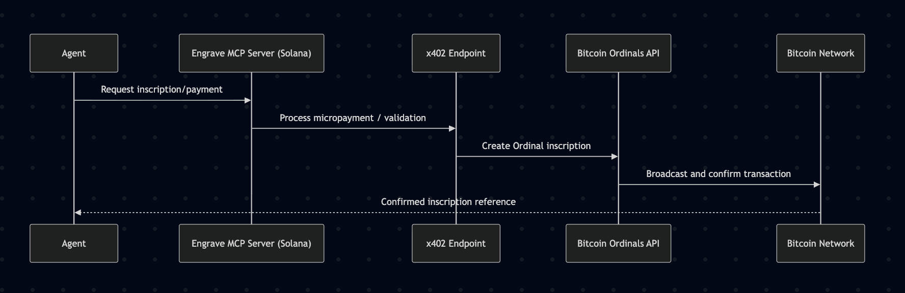

# 🪶 Engrave Protocol

**The first open-source MCP Server that gives AI Agents multifaceted access to the Bitcoin Network via an x402 endpoint hosted on Solana.**

---

## 🧩 Overview

**Engrave Protocol** is an **MCP (Model Context Protocol) Server** designed to bridge the gap between **AI Agents** and the **Bitcoin settlement layer**.  
It enables agents operating on **Solana** to **transact, inscribe, and interact with Bitcoin** through standardized MCP endpoints — unlocking interoperability across the most secure and the most scalable blockchains.

---

## ❗ Problem Statement

Most agentic activity will occur on **Solana** or **Base** due to low fees and near-instant settlement.  
However, **Bitcoin remains the ultimate layer for data permanence and finality.**

There is currently **no unified, open-source infrastructure** that allows AI Agents to interact directly with Bitcoin’s base layer in a permissionless and composable way.

---

## ⚙️ Solution

Engrave Protocol functions as the **connective tissue** between **AI Agent ecosystems** and **Bitcoin’s on-chain settlement**, using:

- **x402 endpoints** for trust-minimized payments and requests
- **Solana MCP servers** for agent orchestration
- **Bitcoin Ordinals inscriptions** for data anchoring and identity proofs

Together, these components enable **AI Agents to inscribe, pay, and operate across layers** with minimal friction.

---

## 🎯 Goals

- 🧠 **Build in Public** — Transparent development and documentation
- 📺 **Daily Streams** — Share progress and experiments live
- 💾 **Open Source** — Continuous uploads to a public GitHub repository
- 🏆 **Hackathon Goal** — Win the official **Solana x402 Hackathon (MCP Track)**

Follow us on [Twitter](https://x.com/engraveprotocol)
