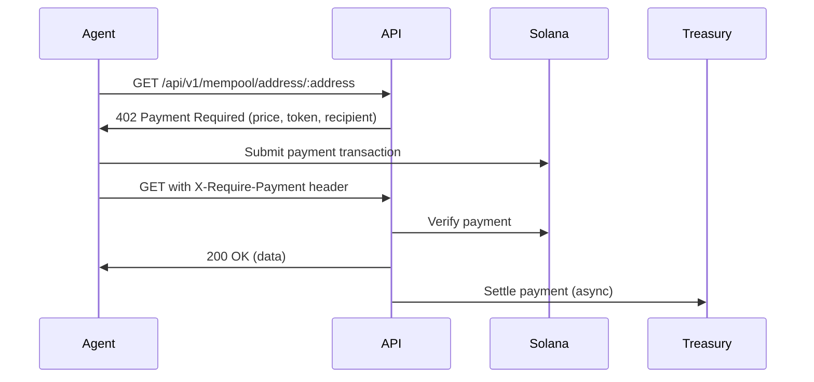

# Engrave Protocol API

> MCP Server bridging AI Agents on Solana with Bitcoin's settlement layer through x402 payment endpoints


## Overview

Engrave Protocol provides a production-ready API that bridges AI agents with Bitcoin blockchain data through micropayment-protected endpoints. Built for the **Solana x402 Hackathon**, it demonstrates how AI agents can autonomously access premium data services using the x402 payment protocol on Solana.

### Key Features

- **43 Bitcoin Data Endpoints** - Comprehensive mempool.space API bridge
- **x402 Payment Integration** - Micropayments from $0.01 to $0.25 USDC on Solana Devnet
- **Model Context Protocol (MCP)** - AI agents can discover and use endpoints autonomously
- **Auto-Generated Documentation** - OpenAPI 3.1 specs from Zod schemas
- **Type-Safe Validation** - Runtime validation with Zod for all requests/responses
- **Rate-Limited HTTP Client** - Prevents hitting mempool.space rate limits

## Quick Start

### Prerequisites

- Node.js >= 18.0.0
- Solana wallet with Devnet USDC
- Git

### Installation

```bash
# Clone the repository
git clone https://github.com/engrave-protocol/engrave-api.git
cd engrave-api

# Install dependencies
npm install

# Configure environment
cp .env.example .env
# Edit .env with your configuration

# Start the API server
npm start
```

### Start MCP Server

```bash
# Development mode with auto-reload
npm run mcp:dev

# Production mode
npm run mcp:start

# Debug with MCP Inspector
npm run mcp:inspect
```

## Architecture

### Tech Stack

- **Runtime**: Node.js 18+
- **Framework**: Express 5.1.0
- **Validation**: Zod + @asteasolutions/zod-to-openapi
- **Payment**: x402-solana (Solana micropayments)
- **Documentation**: OpenAPI 3.1 + Redoc
- **Rate Limiting**: Bottleneck

### Project Structure

```
api/
├── src/
│   ├── config/          # Configuration files
│   │   ├── openapi.js   # OpenAPI spec generator
│   │   ├── swagger.js   # Legacy Swagger config
│   │   └── pricing.js   # Endpoint pricing tiers
│   ├── middleware/      # Express middleware
│   │   ├── validation.js # Zod validation middleware
│   │   ├── cors.js      # CORS configuration
│   │   └── errorHandler.js
│   ├── routes/          # Route definitions
│   │   ├── mempool.routes.js    # Actual route handlers
│   │   ├── mempool.openapi.js   # OpenAPI registrations
│   │   └── openapi.routes.js    # OpenAPI spec endpoint
│   ├── schemas/         # Zod schema definitions
│   │   └── mempool.schemas.js   # All Zod schemas
│   ├── services/        # Business logic
│   │   ├── mempool.service.js   # Mempool.space client
│   │   ├── x402.service.js      # x402 payment logic
│   │   └── manifest.service.js  # MCP manifest
│   ├── mcp/             # Model Context Protocol
│   │   ├── server.js    # MCP server implementation
│   │   └── wallet-utils.js
│   └── app.js           # Express app setup
├── examples/            # Code examples
│   └── migrated-route-example.js
├── MIGRATION_GUIDE.md   # Zod migration guide
└── index.js             # Entry point
```

## API Endpoints

### Endpoint Categories

| Category | Endpoints | Price Range | Description |
|----------|-----------|-------------|-------------|
| **Address Analytics** | 5 | $0.05 - $0.25 | Address info, UTXOs, transactions |
| **Transactions** | 10 | $0.03 - $0.10 | TX details, status, merkle proofs |
| **Blocks** | 11 | $0.02 - $0.15 | Block data, headers, transactions |
| **Fees & Mempool** | 6 | $0.01 - $0.05 | Fee estimates, mempool stats |
| **Mining** | 9 | $0.03 - $0.10 | Pool stats, hashrate, difficulty |
| **Free** | 2 | FREE | Block height, tip hash |

### Payment Tiers

- **Micropayments**: $0.01 - $0.02 USDC (fees, mempool stats)
- **Standard**: $0.03 - $0.10 USDC (most endpoints)
- **Premium**: $0.15 - $0.25 USDC (heavy data endpoints)
- **Free**: Block height, tip hash

## Documentation

### Interactive API Docs

Once the server is running:

- **Redoc UI**: http://localhost:3000/api-docs
- **OpenAPI JSON**: http://localhost:3000/openapi.json
- **Legacy Swagger**: http://localhost:3000/api-docs.json

### x402 Payment Protocol

All paid endpoints require x402 payment headers:

```bash
# Example: Query address info ($0.10 USDC)
curl http://localhost:3000/api/v1/mempool/address/tb1q... \
  -H "X-Require-Payment: true"
```

**Response (402 Payment Required)**:
```json
{
  "error": "Payment required",
  "price": 100000,
  "priceUSD": 0.10,
  "token": "4zMMC9srt5Ri5X14GAgXhaHii3GnPAEERYPJgZJDncDU",
  "recipient": "treasury_address",
  "x402Headers": {
    "X-Require-Payment": "...",
    "X-Accept-Payment": "..."
  }
}
```

## Development

### Adding New Endpoints

The API uses a Zod-first approach where schemas are the single source of truth:

1. **Define Zod Schema** (`src/schemas/mempool.schemas.js`):
```javascript
export const MyResponseSchema = z.object({
  success: z.boolean(),
  data: z.string(),
}).openapi('MyResponse');
```

2. **Register in OpenAPI** (`src/routes/mempool.openapi.js`):
```javascript
registerRoute({
  method: 'get',
  path: '/api/v1/mempool/my-endpoint',
  summary: 'My endpoint',
  description: '🔐 Description. **Cost: $0.05 USDC**',
  tags: ['Category'],
  requiresPayment: true,
  responses: {
    success: {
      description: 'Success',
      schema: MyResponseSchema,
    },
  },
});
```

3. **Implement Route Handler** (`src/routes/mempool.routes.js`):
```javascript
router.get('/my-endpoint',
  verifyPayment(getPrice('mempool', 'myEndpoint'), '/api/v1/mempool/my-endpoint', 'Description'),
  settlePayment,
  async (req, res) => {
    // Implementation
  }
);
```

### Running Tests

```bash
# Run all tests
npm test

# Run x402 integration tests
npm run test:x402

# Watch mode
npm run test:watch
```

### Code Quality

- **Validation**: All requests/responses validated with Zod
- **Type Safety**: JSDoc types + Zod inference
- **Error Handling**: Centralized error middleware
- **Rate Limiting**: Bottleneck prevents API abuse

## x402 Integration

### How It Works

1. **AI Agent** requests endpoint without payment
2. **API** returns 402 with payment requirements
3. **Agent** submits Solana transaction signature
4. **API** verifies payment on-chain
5. **API** returns data and settles payment

### Payment Flow



### Supported Tokens

- **USDC (Devnet)**: 4zMMC9srt5Ri5X14GAgXhaHii3GnPAEERYPJgZJDncDU

## Model Context Protocol (MCP)

The API implements the Model Context Protocol, allowing AI agents to:

1. Discover available endpoints via `.well-known/x402.json`
2. Understand pricing and payment requirements
3. Make autonomous payment decisions
4. Access Bitcoin data programmatically

### MCP Tools

AI agents can use these MCP tools:

- `query_mempool_address` - Get address information
- `query_mempool_transaction` - Get transaction details
- `query_mempool_fees` - Get fee recommendations
- `query_mempool_stats` - Get mempool statistics
- *...and 39 more*

## Deployment

### Environment Variables

```bash
# Required
PORT=3000
NETWORK=testnet
MEMPOOL_API_URL=https://mempool.space/testnet/api

# x402 Configuration
PAYMENT_TOKEN=4zMMC9srt5Ri5X14GAgXhaHii3GnPAEERYPJgZJDncDU
TREASURY_ADDRESS=your_treasury_address
SOLANA_RPC_URL=https://api.devnet.solana.com

# Optional
RATE_LIMIT_MAX=10
RATE_LIMIT_WINDOW=1000
```

### Production Deployment

```bash
# Build for production
npm ci --production

# Start with PM2
pm2 start index.js --name engrave-api

# Or use Docker
docker build -t engrave-api .
docker run -p 3000:3000 engrave-api
```

## Contributing

Contributions are welcome! Please read our contributing guidelines.

### Development Workflow

1. Fork the repository
2. Create a feature branch (`git checkout -b feature/amazing-feature`)
3. Make your changes
4. Run tests (`npm test`)
5. Commit your changes (`git commit -m 'feat: add amazing feature'`)
6. Push to the branch (`git push origin feature/amazing-feature`)
7. Open a Pull Request

## License

MIT License - see [LICENSE](LICENSE) for details

## Acknowledgments

- Built for the **Solana x402 Hackathon**
- Powered by [mempool.space](https://mempool.space) API
- x402 protocol by [PayAI](https://payai.network)
- OpenAPI generation by [@asteasolutions/zod-to-openapi](https://github.com/asteasolutions/zod-to-openapi)

## Contact

- GitHub: [@engrave-protocol](https://github.com/engrave-protocol)
- Issues: [GitHub Issues](https://github.com/engrave-protocol/engrave-api/issues)

---

Built with ❤️ by Engrave Protocol Contributors
